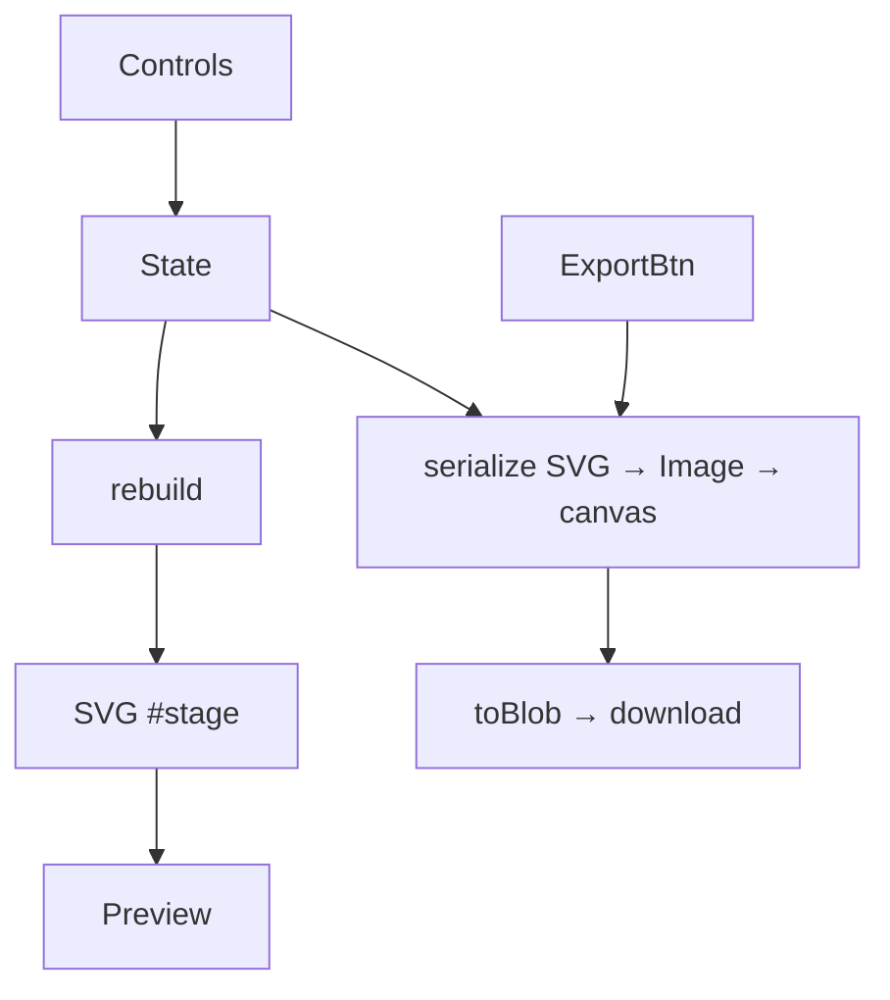

# Background Generator — Design Spec

**Date:** 2026-06-27 (v2 expansion 2026-06-28)
**Status:** v1 (Tasks 1–6) in progress; v2 expansion appended below
**Branch:** `feature/background-generator`

## Purpose

A standalone tool that generates branded, **character-free** background images in
multiple sizes for use in Canva (drop character art / text on top there). It
borrows the SVG-decoration approach from the thumbnail editor's iconography mode
but stays lean — no character, logo machinery, video, or theme persistence.

The visual vocabulary comes from two sources:
- The reference-sheet aesthetic: gradient base, halftone dot clusters, four-point
  sparkle clusters, divider rails, a solid corner nameplate bar.
- The **corrupted-theme** brand tokens (the canonical brand, magenta/purple/dark —
  *not* the blue/lavender of the example character art):
  - `--accent:#d94f90`, `--accent-light:#e86ca8`, `--accent-dark:#b61b70`
  - `--bg:#0a0a0a`, `--bg-secondary:#0f0f1a`
  - `--gradient-accent:linear-gradient(135deg,#d94f90,#b61b70)`
  - `--gradient-purple:linear-gradient(135deg,#8b5cf6,#d94f90)`
  - cyan accent `#00ffff` (used in existing tools for variety)

## Scope decisions (confirmed)

- **Architecture:** standalone — new `tools/background-generator/index.html`, one
  self-contained file. Loads corrupted-theme CDN CSS for the control-panel chrome
  only. NOT a layout mode inside the thumbnail editor.
- **Sizes:** 1920×1080 (16:9), 1080×1920 (9:16), 1080×1080 (1:1).
- **Content:** pure branded chrome. No character slot, no character upload.

## Out of scope (YAGNI)

- Character/image slots, video, html2canvas dependency.
- Theme/state persistence (localStorage), server-side anything.
- X/Twitter 3:1 banner (not selected; trivial to add later via the size table).

## Architecture

Single file, no build step, no framework — consistent with the existing
`tools/thumbnail-generator/` static pattern.

- One `<svg id="stage">` whose `viewBox` matches the selected size preset.
  Left pane = live preview scaled to fit; right pane = controls.
- A single `state` object. Any control change calls `rebuild()`, which clears the
  SVG and re-appends decoration groups in z-order: base → halftone → sparkles →
  rails → nameplate → logo.
- All decoration builders are small pure functions returning SVG node(s); they do
  not read global DOM, only their `(state, corner/opts)` arguments.

### Size table

```
const SIZES = {
  '16:9': { w: 1920, h: 1080 },
  '9:16': { w: 1080, h: 1920 },
  '1:1':  { w: 1080, h: 1080 },
};
```

Adding a size = one row. Decoration builders take corner coordinates derived from
`state.w/state.h`, so they adapt to any aspect ratio.

## Components (decoration builders)

Each returns SVG nodes appended to a named `<g>`. Corners are referenced by name
(`tl`, `tr`, `bl`, `br`) and resolved to coordinates from current `w/h`.

1. **`base(state)`** — full-bleed `<rect>` filled with a solid color or a
   `<linearGradient>` (brand gradient stops, or the lavender variant). One rect.
2. **`halftoneCluster(state, corner)`** — grid of `<circle>` dots anchored at a
   corner, radius shrinking and opacity fading with distance from the corner.
   Density controls grid count.
3. **`sparkleCluster(state, corner)`** — N four-point stars at jittered
   positions/sizes around a corner. Reuse the four-point star path/shape from
   `tools/thumbnail-generator/js/iconography-mode.js` (do not reinvent).
4. **`rails(state)`** — thin top + bottom horizontal `<line>`/`<rect>` divider
   bars spanning width.
5. **`nameplate(state)`** — optional solid corner bar (the dark name-strip in the
   reference sheet). Toggle.
6. **`logo(state)`** — optional wordmark text overlay. Toggle.

### Determinism / randomness note

`Math.random()` is used for jitter and the Randomize button — this is a
browser-only interactive tool, so non-determinism is fine and expected (unlike
workflow scripts). The inline self-check must therefore not assert exact
positions, only structural invariants (node counts, serialization success).

## Layers as named, color-parameterized assets

Each decoration is a **named layer** with its own independently settable color
(not a single global accent). `state.layers` is keyed by layer name:

```
state.layers = {
  base:      { on: true,  style: 'lavender', color: '#c7c4ec', color2: '#eef0fb' },
  halftone:  { on: true,  color: '#1a1430', density: 'med', corners: ['tl'] },
  sparkles:  { on: true,  color: '#1a1430', count: 6,        corners: ['tr','br'] },
  rails:     { on: true,  color: '#1a1430' },
  nameplate: { on: false, color: '#0a0a0a', corner: 'bl' },
  logo:      { on: false, color: '#f5f1f8' },
};
```

Builders read only their own layer entry, so changing or recoloring one layer
never touches another. A `PALETTE` table of named brand swatches (lavender,
pink `#d94f90`, purple `#8b5cf6`, cyan `#00ffff`, ink `#1a1430`, dark `#0a0a0a`)
backs the color pickers and the Randomize button; layers may also take a free
hex value.

**Default base style is `lavender`** (vertical gradient `#c7c4ec` → `#eef0fb`,
matching the reference sheet), with the brand magenta/purple/dark available as
alternate base styles and layer colors.

## Controls

- Size preset (3 options).
- Per layer, in its own control group: on/off, a **color picker** (PALETTE
  swatches + free hex), and layer-specific options:
  - base: style (lavender / solid / gradient-purple / gradient-accent) + color(s)
  - halftone: density, which corner(s)
  - sparkles: count, which corner(s)
  - nameplate: corner
- **🎲 Randomize variant** — randomizes base style, per-layer colors (from
  PALETTE), corner assignment of halftone vs sparkles, and densities, then
  `rebuild()`. For fast variant spinning.

## Export (no dependencies)

Native SVG → canvas → PNG, so the tool has zero JS dependencies of its own:

1. Build the SVG at the target preset's exact pixel `width`/`height` (clone the
   stage or rebuild into a detached SVG so the on-screen preview scaling is not
   captured).
2. Serialize with `XMLSerializer`, wrap in a `data:image/svg+xml` URL.
3. Load into an `Image`, draw onto an offscreen `<canvas>` sized to the preset.
4. `canvas.toBlob(blob => download, 'image/png')`.

- **Export PNG** — current size.
- **Export all sizes** — loops the three presets, downloading each.
- Filenames: `bg_<baseStyle>_<w>x<h>.png`.



## Testing

Manual browser testing is the primary validation (consistent with repo's
no-automated-suite convention). Plus ONE inline self-check (a `runSelfCheck()`
callable from console / `?selftest=1`) asserting:

- SVG serializes to a non-empty string after `rebuild()`.
- `halftoneCluster` with density N emits the expected number of `<circle>` nodes.
- `sparkleCluster` with count N emits N star nodes.
- Rasterize promise resolves to a PNG blob of non-zero size.

No frameworks, no fixtures.

## File organization

- `tools/background-generator/index.html` — the tool (HTML + inline CSS + inline JS).
- If JS grows past ~400 lines, split decoration builders into
  `tools/background-generator/js/decorations.js`; otherwise keep inline.
- No new root-level files. No new dependencies.

## Validation checklist (per CLAUDE.md)

- Work on `feature/background-generator`, not main. ✓
- No secrets, no S3 uploads (tool is local/static).
- Static page auto-deploys via Cloudflare Pages on push; no Worker change, so no
  `wrangler deploy` needed.
- Manual browser test at the three sizes; confirm exported PNG dimensions match
  presets exactly.

---

# v2 — Scope Expansion (2026-06-28)

After seeing v1 Tasks 1–3, the user asked for: halftone that covers more than
corners; corrupted-theme color themes; and distinctive "make it mine" expressive
elements — scanlines+vignette, RGB glitch split, warning-glyphs + lewd/NSFW
phrases, noise grain, an audio-spectrum-bar graph, and EVA-style patterns drawn
from the Celeste TTS bot overlays.

Concrete visual values are captured in `.superpowers/sdd/refs.md` (palette, theme
table, spectrum, EVA coords, scanline/vignette/noise/glitch recipes, lewd-frame
reuse facts). The architecture is unchanged: every item is a named layer with a
small pure builder appended by `rebuild()` in z-order; each reads only its own
`state.layers[name]` entry.

## Modifications to v1

- **Halftone `spread`** control: `corner` (v1 triangular), `edge-fade` (a band
  fading from one edge), `full-field` (dots across the whole canvas, opacity
  following a directional gradient — the dotted field in the reference sheet).
- **Theme presets**: a `THEMES` table (lavender / corrupted / abyss / succubus)
  and `applyTheme(name)` that recolors every layer at once, then `syncControls()`
  + `rebuild()`. A theme dropdown drives it. Per-layer color pickers still work
  for manual overrides after a theme is applied.
- **Extended `PALETTE`** with the tts-bot brand hexes (cyan, purple, magenta,
  red, yellow, evaOrange #ff6600, neonMagenta #ff00ff, deepBlue) — see refs.md.

## New layers (z-order, bottom→top)

base → halftone → **spectrum** → **eva** → sparkles → **glyphs+phrases** →
rails → nameplate → logo → **glitch** → **scanlines+vignette** → **noise**.

1. **spectrum** — ~50 bottom-anchored flat bars, static randomized heights,
   per-bar vertical gradient magenta→purple→cyan, ~0.6 opacity.
2. **eva** — orange corner L-brackets, purple hexagons, magenta crosshairs,
   faint corruption diagonals; coords in refs.md scaled by `w/1920, h/1080`.
3. **glyphs+phrases** — ⚠/◈ glyphs in corners plus one phrase rendered as SVG
   `<text>` in a band. Phrase pools imported from the existing self-contained ES
   module `tools/thumbnail-generator/js/lewd-frame.js`
   (`LEWD_PHRASES_SFW`/`LEWD_PHRASES_NSFW`/`pickLewdFramePhrases`); an **nsfw**
   toggle selects the pool. We reuse the phrase *data* only, not the canvas
   `drawLewdFrame`. This requires the tool's inline `<script>` to become
   `<script type="module">`.
4. **glitch** — a few horizontal slices with cyan/red offset fills (static).
5. **scanlines+vignette** — 2px-pitch line pattern + radial-gradient vignette.
6. **noise** — full-bleed rect filled via an SVG `feTurbulence` filter, low opacity.

## Export note (NSFW)

NSFW phrases are opt-in (toggle defaults OFF in this generator, even though
lewd-frame's own default is spicy). Exported filenames keep the existing
`bg_<baseStyle>_<w>x<h>.png` form; add `_nsfw` suffix when the nsfw glyph layer
is enabled, consistent with the repo's art-asset naming convention (CLAUDE.md §6.4).

## Module conversion risk

Switching the inline script to `type="module"` means top-level names are no
longer global. The page uses `addEventListener` (no inline `on*=` handlers), so
this is low-risk; the only global needed is `window.runSelfCheck` for the
`?selftest=1` boot path — expose it explicitly. This conversion happens in the
task that first needs the import (glyphs+phrases).

## Updated layer count → task plan

v1 Tasks 4–6 (rails+nameplate+logo, export, randomize) remain. New tasks are
inserted so export stays layer-agnostic and randomize/theme come last:
Task 4 rails+nameplate+logo · Task 5 themes + halftone-spread · Task 6 spectrum ·
Task 7 eva · Task 8 glyphs+phrases (module conversion) · Task 9 screen-FX
(glitch + scanlines/vignette + noise) · Task 10 export · Task 11 randomize +
theme sync.
